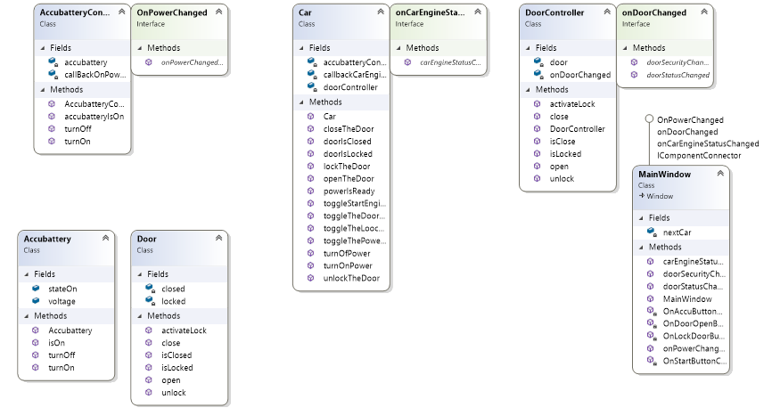

# TheNextCar
## 1. Class Diagram Project

## 2. Fungsi atau Kegunaan dari `DoorController.cs`

Fungsi dari Class `DoorController.cs` yaitu berisi method dari door yang mencakup `Close() Open() activateLock() unlock() isClose() isLocked()` dan interface `onDoorChanged` yang mengcontrol fungsi dari door dan yang memberikan keterangan ketika door dibuka maupun dikunci    

## 3. Fungsi atau Kegunaan dari model `Door.cs` 
Fugsi dari model `Door.cs` yaitu mengatur logic boolean pada door ketika closed dan locked

## 4. Fungsi atau Kegunaan dari interface `OnDoorChanged`
Fungsi dari interface `OnDoorChanged` yaitu untuk menampung method dari `doorSecurityChanged` dan `doorStatusChanged` yang menyimpan nilai string value dan message dari door